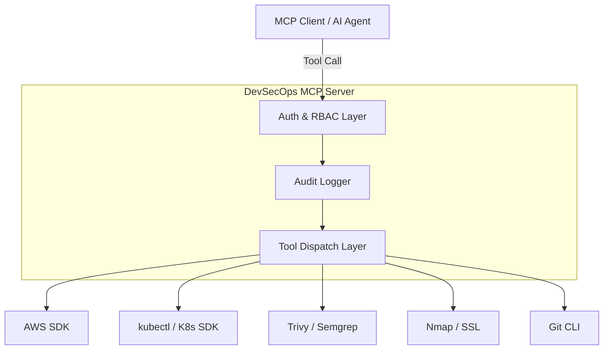

<div align="center">
  <h1>🛡️ DevSecOps MCP Server</h1>
  <p><b>An open-source Model Context Protocol (MCP) server for DevOps and Security automation workflows.</b></p>

  [](https://opensource.org/licenses/MIT)
  [](https://www.python.org/downloads/)
  [](https://modelcontextprotocol.io/)
  [](https://www.docker.com/)
</div>

---

**DevSecOps MCP Server** empowers AI assistants (like Claude, Cursor, and GitHub Copilot) to perform complex cloud architecture administration, security scanning, and network analyses directly from their execution environments. It wraps powerful underlying tools and SDKs into secure, heavily-audited MCP tool sets.

By standardizing access securely, you can allow AI agents to troubleshoot Kubernetes clusters, analyze Terraform/infrastructure logic, scan for hardcoded secrets, and fetch AWS configurations—while maintaining absolute control over what the AI is allowed to do.

---

## 🌟 Key Features

- 🚀 **FastMCP Server**: Exposes domain-specific tools for AWS, Kubernetes, security scanning, Git, network analysis, and CI/CD pipelines.
- 🔐 **Robust Authorization**: Features built-in JWT-based identity extraction with role-based (RBAC) and scope-based tool-level checks.
- 📜 **Structured Audit Logging**: Emits clean JSON audit logs for every invocation (start, success, fail, duration) suitable for SIEM integrations.
- 🛠 **Expandable Tooling**: Easily drops in new integrations. Includes ready-to-use scanners for dependencies, secrets, SL/TLS certs, Semgrep, Trivy, and more.
- 📦 **Docker Ready**: Provides a containerized deployment using a non-root runtime environment with built-in health checks.
- 🌐 **ASGI Integration**: Mounts a fast, native FastAPI health endpoint alongside the MCP streamable-http transport for reliable health-checking.

---

## 📐 Architecture



The server receives MCP tool-call requests over the **streamable HTTP** transport. Each request requires a JWT bearer token, decoded to extract the caller's identity (`subject`, `role`, `scopes`). The authorization layer verifies this against YAML-defined `roles.yaml` and `scope_rules.yaml`. On success, the domain tool is invoked, and a structured audit log entry is immediately emitted.

---

## 🧰 Available Tools Reference

DevSecOps MCP Server currently provides the following comprehensive toolset out-of-the-box. Every tool requires a valid `token` parameter.

### Cloud & DevOps
* **`aws_list_ec2_instances`**: List EC2 instances in a specific AWS region.
* **`aws_check_s3_public_access`**: Audit S3 buckets for open public access settings.
* **`k8s_list_pods`**: Retrieve a list of Kubernetes pods running in a given namespace.
* **`cicd_pipeline_status`**: Fetch the execution status of an external CI/CD pipeline.
* **`git_recent_commits`**: Fetch recent commit history from the currently active Git repository.

### Application Security & SAST
* **`security_semgrep_scan`**: Run a Semgrep SAST scan on a local directory or file. (Includes custom configuration profiles like `p/python` etc).
* **`security_run_trivy_scan`**: Run an aggressive Trivy vulnerability scan against a container image reference.
* **`security_scan_secrets`**: Scan local files/directories for exposed secrets (API keys, tokens, hardcoded passwords).
* **`security_check_dependencies`**: Analyze dependency files (e.g., `requirements.txt`, `package.json`) for known vulnerabilities using the OSV.dev database.

### Network & Infrastructure Security
* **`network_port_scan`**: Perform a TCP port scan to detect publicly exposed services on specific hosts.
* **`security_check_ssl_certificate`**: Extract and validate SSL/TLS certificate details (validity chains, algorithms, and expiry dates) for a target domain.
* **`security_check_http_headers`**: Audit external URLs for critical security headers (HSTS, CSP, X-Frame-Options, etc.).

---

## 🚀 Getting Started

### Prerequisites

* **Python 3.12+**
* External binaries for specific tools to function:
  * AWS CLI / `boto3` environment config
  * `kubectl`
  * Trivy
  * Semgrep

### Local Deployment

Clone the repository and install dependencies:

```bash
git clone https://github.com/raghulvj01/devsecops-mcp.git
cd devsecops-mcp

# Setup Virtual Environment
python -m venv .venv
source .venv/bin/activate  # On Windows: .venv\Scripts\activate

# Install Dependencies
pip install -r requirements.txt

# Start Server (Standalone)
python -m server.main
```

### ASGI Deployment (Recommended)

Run the server with Uvicorn to expose a `/health` endpoint while serving the MCP transport at `/mcp`.

```bash
uvicorn server.health:app --host 0.0.0.0 --port 8000
```

Verify service health:
```bash
curl http://localhost:8000/health
# {"status": "ok", "service": "devsecops"}
```

### Docker Deployment

```bash
docker build -t devsecops-mcp .
docker run -p 8000:8000 devsecops-mcp
```
*(The Docker image runs via a non-root user (UID 10001) for enhanced security.)*

---

## ⚙️ Configuration

Control server settings entirely via Environment Variables:

| Variable | Description | Default |
|---|---|---|
| `MCP_SERVICE_NAME` | Name of the MCP service | `devsecops` |
| `MCP_ENV` | Environment identifier (`dev`, `staging`, `prod`) | `dev` |
| `MCP_ROLES_FILE` | Path to roles policy YAML file | `policies/roles.yaml` |
| `MCP_SCOPES_FILE` | Path to scopes policy YAML file | `policies/scope_rules.yaml` |
| `OIDC_ISSUER` | Expected JWT `iss` claim | *None* |
| `OIDC_AUDIENCE` | Expected JWT `aud` claim | *None* |

---

## 🤖 Usage Guide for AI Agents

Provide the ability to execute these tools directly from your modern AI IDEs and Chat Interfaces.

### Cursor / Windsurf

Add the following to your MCP settings inside your workspace (`.cursor/mcp.json` or `.windsurf/mcp.json`):

```json
{
  "mcpServers": {
    "devsecops": {
      "url": "http://localhost:8000/mcp"
    }
  }
}
```

### Claude Desktop

Append to your `claude_desktop_config.json` (Mac: `~/Library/Application Support/Claude/`, Windows: `%APPDATA%\Claude\`):

```json
{
  "mcpServers": {
    "devsecops": {
      "url": "http://localhost:8000/mcp"
    }
  }
}
```

---

## 🗝 Access Control: Roles & Scopes

Every tool requires a `token` argument containing a JWT. 
> *By default, the scaffold uses unsigned decodes. Always integrate your JWKS validator in `server/auth.py` for Production use.*

### Generating a Local Test Payload

```bash
TOKEN=$(python -c "
import base64, json
h = base64.urlsafe_b64encode(json.dumps({'alg': 'none'}).encode()).rstrip(b'=').decode()
p = base64.urlsafe_b64encode(json.dumps({'sub': 'dev-user', 'role': 'admin', 'scope': 'devsecops.read devsecops.security'}).encode()).rstrip(b'=').decode()
print(f'{h}.{p}.')
")

echo $TOKEN
```

### Managing Policies

Edit `policies/roles.yaml` and `policies/scope_rules.yaml` to configure what permissions are required. 
A tool execution is authorized if EITHER the user's role grants access, OR if any of the user's scopes grant access.

#### Example `policies/roles.yaml`:
```yaml
roles:
  viewer:
    - aws_list_ec2_instances
    - k8s_list_pods
  security:
    - security_run_trivy_scan
    - security_semgrep_scan
  admin:
    - aws_list_ec2_instances
    - k8s_list_pods
    - security_run_trivy_scan
    - security_semgrep_scan
    # ... and so on
```

---

## 📝 Audit Logging

Ensure strict observability over AI actions. The `@audit_tool_call` decorator emits cleanly structured JSON directly to STDOUT, ready for ingestion by Splunk, Datadog, ELK, etc.

**Successful Call Example:**
```json
{
  "timestamp": "2026-03-06T08:00:01+00:00",
  "level": "INFO",
  "message": "tool_call_succeeded",
  "logger": "mcp.devsecops.audit",
  "event": "tool_call_succeeded",
  "tool": "security_run_trivy_scan",
  "duration_ms": 1204
}
```

---

## 🛡️ Security Best Practices

When deploying this server into sensitive infrastructure:
1. **Enforce JWT Signature Validation**: You *must* update `server/auth.py` to cryptographically verify RS256 JWTs using your IdP's JWKS endpoint.
2. **Restrict Underlying Scopes**: The AWS / GCP / K8s credentials assigned to the Server environment should strictly map to least-privilege ReadOnly policies, preventing the LLM from making accidental destructive changes.
3. **Monitor the Logs**: Forward JSON audit logs to a SIEM. Set up anomaly detection on aggressive looping (e.g. infinite loop LLM requests).

---

## 🤝 Contributing

We welcome contributions from the community! Open-source makes security tooling better for everyone.

1. Fork the Project.
2. Create your Feature Branch (`git checkout -b feature/AmazingFeature`).
3. Add your standard tool into `tools/<domain>/`.
4. Register your tool via `@mcp.tool()` inside `server/main.py` ensuring you include the `@audit_tool_call` decorator and authorize check.
5. Create tests in the `tests/` directory to maintain full coverage.
6. Commit your changes and Open a Pull Request!

---

## 📄 License

Distributed under the MIT License. See `LICENSE` for more information.
